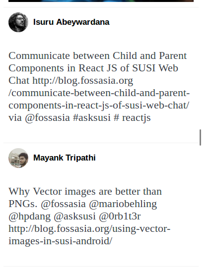

# loklak-timeline-plugin
JavaScript plugin for embedding loklak timeline to web pages
# How to
Reference the javascript manually
```html
<script src="https://cdn.jsdelivr.net/gh/fossasia/loklak-timeline-plugin/plugin.js"></script>
```
Add the tag to the html
```html
<div class="loklak-timeline" data-query="fossasia" data-height="300", data-width="700">
```
|parameter|description|
|---------|-----------|
|data-query|query keyword|
|data-height|height of timeline|
|data-width|width of timeline|

# Screenshot

